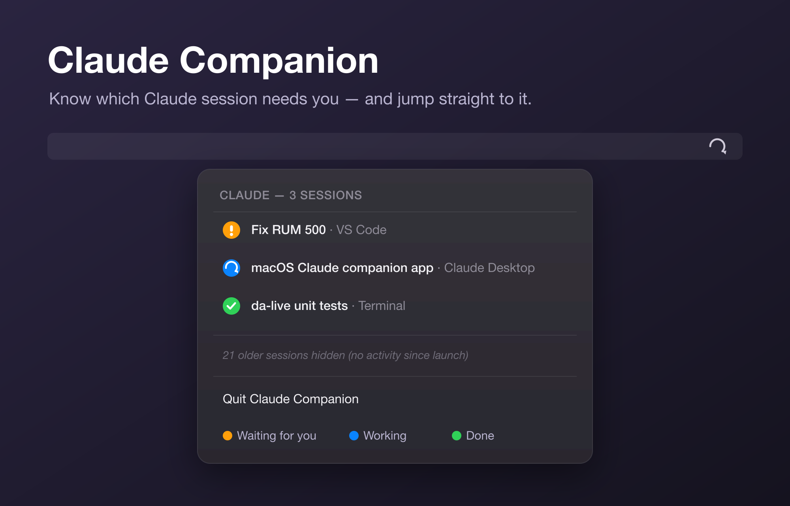

# Claude Companion

A macOS menu bar "control center" for your Claude Code sessions — across the
Terminal CLI, the VS Code extension, and the Claude Desktop app.



- **Menu bar icon** that *animates* while any session is thinking, shows an
  **orange attention badge** when a session is waiting for you, and sits calm
  when everything is done.
- **Click the icon** to see every live session, sorted so the ones needing you
  float to the top:
  - 🔵 **Working** — Claude is generating / running tools
  - 🟠 **Waiting for you** — a permission prompt or notification
  - 🟢 **Done** — finished its turn, awaiting your next prompt
- **Click a session** to jump straight to where it lives:
  - the right **VS Code window**, **terminal tab**, or **Claude Desktop**, and
  - for **PaperclipAI** sessions (`sdk-cli`, driven in the browser), the session
    is labelled with its issue key (e.g. `COR-95`) and clicking brings **Chrome**
    to the front. (Switching to the exact issue tab isn't reliable across
    multiple Chrome profiles, so it just focuses the browser.)

## How it works

Claude Code already records every live session in `~/.claude/sessions/<pid>.json`
and every connected IDE in `~/.claude/ide/<pid>.lock`. The companion watches
those for **which** sessions exist and **where** they run.

For **what each session is doing**, it relies on Claude Code **hooks**. A tiny
script (`scripts/claude-companion-hook`) runs on each hook event and writes
`~/.claude/companion-state/<sessionId>.json`:

| Hook event | State written |
|---|---|
| `UserPromptSubmit`, `PreToolUse`, `PostToolUse`, `PreCompact` | `thinking` |
| `Notification` | `waiting` |
| `Stop`, `SubagentStop`, `SessionEnd` | `idle` |

The app polls these directories (~1.5s) and re-renders the menu bar.

## Setup

### 1. Install the hooks (one time)

The installer **defaults to a dry-run**. Review the output, then re-run with `-x`:

```sh
node scripts/install-hooks.mjs        # preview the change
node scripts/install-hooks.mjs -x     # apply (backs up settings.json first)
```

It merges into `~/.claude/settings.json` without touching your existing hooks,
and is idempotent (re-running replaces only the companion entries).
To remove: `node scripts/install-hooks.mjs -r -x`.

Restart any already-running Claude Code sessions so they pick up the hooks.

### 2. Build and run the app

```sh
swift build && swift run        # quick dev run
# — or build a proper menu bar .app bundle —
scripts/setup-signing.sh        # one time: stable self-signed identity (see below)
scripts/build-app.sh            # dry-run
scripts/build-app.sh -x         # build ClaudeCompanion.app
open ClaudeCompanion.app
```

**Run `scripts/setup-signing.sh` once before building.** It creates a stable,
self-signed code-signing identity in your login keychain. Without it the app is
ad-hoc signed, its identity changes on every rebuild, and macOS forgets the
Accessibility permission — re-prompting you on every click. With it, the grant
sticks across rebuilds.

### 3. Grant permissions (first jump-to-window)

Jumping to the right window uses the Accessibility API. On first use macOS
prompts once; grant it in **System Settings → Privacy & Security →
Accessibility** (enable **Claude Companion**), then click the session again.

- Terminal/iTerm tab targeting additionally uses **Automation** (to read the
  controlling TTY), which prompts separately.
- PaperclipAI (`sdk-cli`) sessions just bring **Google Chrome** to the front
  (via LaunchServices) — no extra permission needed.
- If you previously ran an ad-hoc build, remove any stale **Claude Companion**
  entries from the Accessibility list first, then grant the signed build once.

## Development

```sh
swift test                      # unit tests for the parsing + state logic
swift build
```

### Layout

| Path | Role |
|---|---|
| `Sources/ClaudeCompanion/Models.swift` | session / state / IDE-lock models + hook→activity mapping |
| `Sources/ClaudeCompanion/SessionMonitor.swift` | discovers sessions, checks liveness, merges state |
| `Sources/ClaudeCompanion/StatusItemController.swift` | menu bar icon (animated) + session menu |
| `Sources/ClaudeCompanion/WindowActivator.swift` | jump-to-window per entrypoint |
| `Sources/ClaudeCompanion/WindowFocuser.swift` | native Accessibility-API window raising + title matching |
| `Sources/ClaudeCompanion/Paperclip.swift` | PaperclipAI issue-key extraction + issue URL building |
| `scripts/claude-companion-hook` | per-event state writer (runs inside Claude Code) |
| `scripts/install-hooks.mjs` | wires the hooks into `settings.json` (dry-run by default) |
| `scripts/setup-signing.sh` | one-time stable self-signed code-signing identity |
| `scripts/build-app.sh` | assembles + signs the `.app` bundle |

## Status / roadmap

Working MVP. Possible next steps:
- File-system event watching (FSEvents) instead of polling.
- Richer per-session labels from the transcript `ai-title`.
- Terminal-tab targeting for more emulators (Ghostty, WezTerm, kitty).
- Login-item helper and notarized build.
